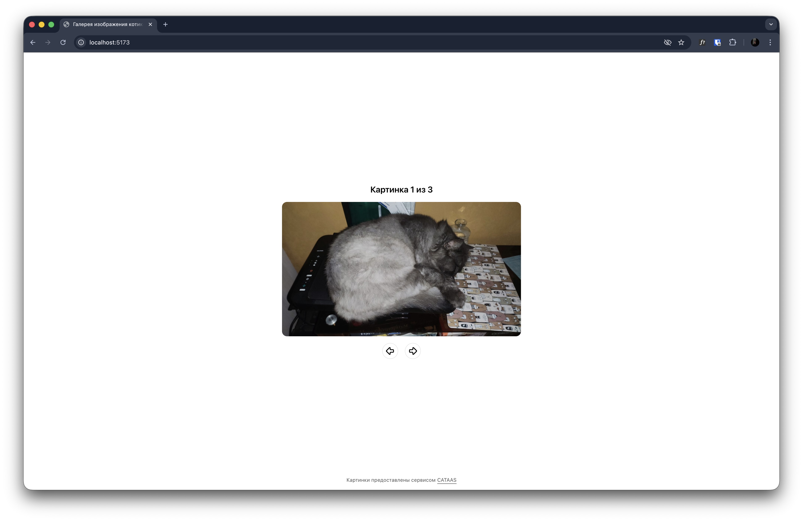
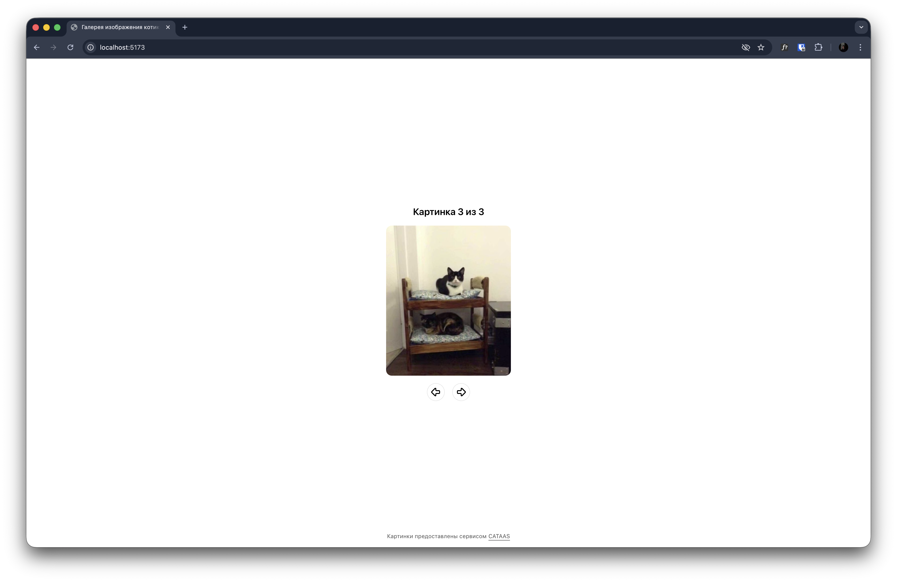

# Галерея изображений

Репозиторий содержит исходный код галереи изображений, созданной на основе **React** и **TailwindCSS**.

## Особенности

* Компонентная архитектура на **React + TypeScript**
* Стилизация с использованием **TailwindCSS**
* Поддержка современных инструментов качества кода (**ESLint**, **Prettier**)

## Установка и запуск

1. Склонируйте репозиторий:
```bash
git clone https://github.com/Pelfox/gallery-scroller.git
```

2. Установите зависимости:
```bash
pnpm install   # если используете pnpm
npm install    # если используете npm
```

3. Запустите проект в режиме разработки:
```bash
pnpm dev       # если используете pnpm
npm run dev    # если используете npm
```

## Использованные технологии

* React 19
* TailwindCSS 4
* TypeScript 5
* Vite 7

## Демонстрация





